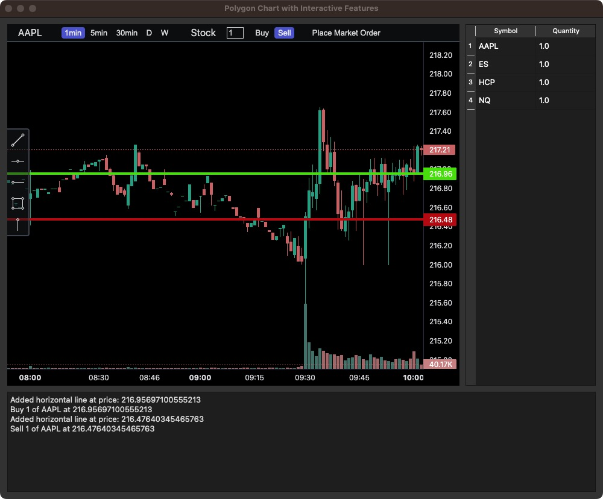

# Change

## Introduction

This project builds upon the lightweight-charts-python library by introducing a new class `PolygonQchart` defined in `combined_window.py`, which merges functionality from `Polygonchart` and `Qtchart` (PyQt5). This integration utilizes the `ib_insync` library to work with the Trader Workstation API from Interactive Brokers. The data source is provided by Polygon. This application is designed to interact dynamically with market data and execute trading strategies effectively.

## Prerequisites
For an isolated package installation, it's recommended to create and activate a virtual environment:

### Create and Activate Virtual Environment

- **Create venv:**

  ```bash
  $ python -m venv venv
  ```

For an isolated package installation, it's recommended to create and activate a virtual environment:

- **Activation:**

  ```bash
  # Linux/Mac
  $ source venv/bin/activate

  # Windows
  # Command Prompt
  $ venv\Scripts\activate.bat
  # PowerShell
  $ venv\Scripts\Activate.ps1
  ```

### Install Required Packages

  ```bash
  $ pip install -r requirements.txt
  ```

### Running the Application
    
  ```bash
  python combined_test.py
  ```

## Configuration

- Replace the API key in `combined_test.py` at line 101:

  ```bash
  loop.create_task(main(api_key="<YOUR_API_KEY>"))
  ```

- Interactive Brokers parameters need to be adjusted in `combined_window.py` at lines 180 and 218, and in `combined_test.py` at line 67:

  ```bash
  # combined_window.py line 180
  self.account = 'DU8014278'
  # combined_window.py line 218
  await self.ib.connectAsync('127.0.0.1', 7497, clientId=10)
  # combined_test.py line 67
  positions = self.chart.ib.positions(account='DU8014278')
  ```

- If you do not wish to use real-time data or if your API key does not have real-time permissions, change `live=True` to `False` in `combined_test.py` at line 20:

  ```bash
  self.chart = PolygonQChart(api_key=api_key, widget=widget, width=750, height=600, live=True)
  ```

## GUI Features



### Chart

- Trigger the search function with `Ctrl-F` to input a symbol. Ensure the symbol follows specific formats:

    - **Stock**: Just use the ticker symbol.
        - Example: `AAPL`
    - **Option**: Use the full option chain identifier.
        - Example: `SPY251219C00650000`
    - **Index**: Start with a caret (`^`).
        - Example: `^SPX`
    - **Forex**: Use the currency pair code.
        - Example: `EURUSD`
    - **Crypto**: Include a hyphen between the base and quote currencies.
        - Example: `BTC-USD`

- Utilize the toolbox on the left to draw horizontal lines, vertical lines, boxes, trendlines, and ray lines.
- Creating a horizontal line takes into account the `Quantity` and `Buy/Sell` options from the topbar, aligning the line price with the current market price to create corresponding orders sent to the Interactive Brokers platform.
- Dragging a horizontal line updates both the line and the associated order; right-click to delete.
- All drawings are stored under the corresponding symbol, maintaining state between sessions and program restarts, with drawings persisted in `drawings.json`.

### Sidebar (TableWidget)

- Displays symbols and quantities for positions in the account.
- Clicking a symbol navigates to its chart data.
- Refreshes periodically.

### Topbar

- Displays the current symbol, a timeframe switcher, security type (auto-detected based on the queried symbol), a quantity textbox, operation switcher, and a market order button.

### LogWidget

- Logs messages when horizontal lines are added, updated, or removed.

## References
[Trading View](https://tradingview.github.io/lightweight-charts/docs/api)

[Polygon](https://polygon.io/docs/stocks/getting-started)

[lightweight-charts-python](https://lightweight-charts-python.readthedocs.io/en/latest/tutorials/getting_started.html)

[ib_insync](https://ib-insync.readthedocs.io/readme.html)

<div align="center">

# lightweight-charts-python

[](https://pypi.org/project/lightweight-charts/)
[](https://python.org "Go to Python homepage")
[](https://github.com/louisnw01/lightweight-charts-python/blob/main/LICENSE)
[](https://lightweight-charts-python.readthedocs.io/en/latest/index.html)


lightweight-charts-python aims to provide a simple and pythonic way to access and implement [TradingView's Lightweight Charts](https://www.tradingview.com/lightweight-charts/).
</div>


## Installation
```
pip install lightweight-charts
```
___

## Features
1. Streamlined for live data, with methods for updating directly from tick data.
2. Multi-pane charts using [Subcharts](https://lightweight-charts-python.readthedocs.io/en/latest/reference/abstract_chart.html#AbstractChart.create_subchart).
3. The [Toolbox](https://lightweight-charts-python.readthedocs.io/en/latest/reference/toolbox.html), allowing for trendlines, rectangles, rays and horizontal lines to be drawn directly onto charts.
4. [Events](https://lightweight-charts-python.readthedocs.io/en/latest/tutorials/events.html) allowing for timeframe selectors (1min, 5min, 30min etc.), searching, hotkeys, and more.
5. [Tables](https://lightweight-charts-python.readthedocs.io/en/latest/reference/tables.html) for watchlists, order entry, and trade management.
6. Direct integration of market data through [Polygon.io's](https://polygon.io/?utm_source=affiliate&utm_campaign=pythonlwcharts) market data API.

__Supports:__ Jupyter Notebooks, PyQt6, PyQt5, PySide6, wxPython, Streamlit, and asyncio.

PartTimeLarry: [Interactive Brokers API and TradingView Charts in Python](https://www.youtube.com/watch?v=TlhDI3PforA)
___

### 1. Display data from a csv:

```python
import pandas as pd
from lightweight_charts import Chart


if __name__ == '__main__':
    
    chart = Chart()
    
    # Columns: time | open | high | low | close | volume 
    df = pd.read_csv('ohlcv.csv')
    chart.set(df)
    
    chart.show(block=True)

```

___

### 2. Updating bars in real-time:

```python
import pandas as pd
from time import sleep
from lightweight_charts import Chart

if __name__ == '__main__':

    chart = Chart()

    df1 = pd.read_csv('ohlcv.csv')
    df2 = pd.read_csv('next_ohlcv.csv')

    chart.set(df1)

    chart.show()

    last_close = df1.iloc[-1]['close']
    
    for i, series in df2.iterrows():
        chart.update(series)

        if series['close'] > 20 and last_close < 20:
            chart.marker(text='The price crossed $20!')
            
        last_close = series['close']
        sleep(0.1)

```


___

### 3. Updating bars from tick data in real-time:

```python
import pandas as pd
from time import sleep
from lightweight_charts import Chart


if __name__ == '__main__':
    
    df1 = pd.read_csv('ohlc.csv')
    
    # Columns: time | price 
    df2 = pd.read_csv('ticks.csv')
    
    chart = Chart()
    
    chart.set(df1)
    
    chart.show()
    
    for i, tick in df2.iterrows():
        chart.update_from_tick(tick)
            
        sleep(0.03)

```

___

### 4. Line Indicators:

```python
import pandas as pd
from lightweight_charts import Chart


def calculate_sma(df, period: int = 50):
    return pd.DataFrame({
        'time': df['date'],
        f'SMA {period}': df['close'].rolling(window=period).mean()
    }).dropna()


if __name__ == '__main__':
    chart = Chart()
    chart.legend(visible=True)

    df = pd.read_csv('ohlcv.csv')
    chart.set(df)

    line = chart.create_line('SMA 50')
    sma_data = calculate_sma(df, period=50)
    line.set(sma_data)

    chart.show(block=True)

```

___

### 5. Styling:

```python
import pandas as pd
from lightweight_charts import Chart


if __name__ == '__main__':
    
    chart = Chart()

    df = pd.read_csv('ohlcv.csv')

    chart.layout(background_color='#090008', text_color='#FFFFFF', font_size=16,
                 font_family='Helvetica')

    chart.candle_style(up_color='#00ff55', down_color='#ed4807',
                       border_up_color='#FFFFFF', border_down_color='#FFFFFF',
                       wick_up_color='#FFFFFF', wick_down_color='#FFFFFF')

    chart.volume_config(up_color='#00ff55', down_color='#ed4807')

    chart.watermark('1D', color='rgba(180, 180, 240, 0.7)')

    chart.crosshair(mode='normal', vert_color='#FFFFFF', vert_style='dotted',
                    horz_color='#FFFFFF', horz_style='dotted')

    chart.legend(visible=True, font_size=14)

    chart.set(df)

    chart.show(block=True)

```

___

### 6. Callbacks:

```python
import pandas as pd
from lightweight_charts import Chart


def get_bar_data(symbol, timeframe):
    if symbol not in ('AAPL', 'GOOGL', 'TSLA'):
        print(f'No data for "{symbol}"')
        return pd.DataFrame()
    return pd.read_csv(f'bar_data/{symbol}_{timeframe}.csv')


def on_search(chart, searched_string):  # Called when the user searches.
    new_data = get_bar_data(searched_string, chart.topbar['timeframe'].value)
    if new_data.empty:
        return
    chart.topbar['symbol'].set(searched_string)
    chart.set(new_data)


def on_timeframe_selection(chart):  # Called when the user changes the timeframe.
    new_data = get_bar_data(chart.topbar['symbol'].value, chart.topbar['timeframe'].value)
    if new_data.empty:
        return
    chart.set(new_data, True)


def on_horizontal_line_move(chart, line):
    print(f'Horizontal line moved to: {line.price}')


if __name__ == '__main__':
    chart = Chart(toolbox=True)
    chart.legend(True)

    chart.events.search += on_search

    chart.topbar.textbox('symbol', 'TSLA')
    chart.topbar.switcher('timeframe', ('1min', '5min', '30min'), default='5min',
                          func=on_timeframe_selection)

    df = get_bar_data('TSLA', '5min')
    chart.set(df)

    chart.horizontal_line(200, func=on_horizontal_line_move)

    chart.show(block=True)

```

___

<div align="center">

[](https://lightweight-charts-python.readthedocs.io/en/latest/index.html)

Inquiries: [shaders_worker_0e@icloud.com](mailto:shaders_worker_0e@icloud.com)
___

_This package is an independent creation and has not been endorsed, sponsored, or approved by TradingView. The author of this package does not have any official relationship with TradingView, and the package does not represent the views or opinions of TradingView._
</div>
